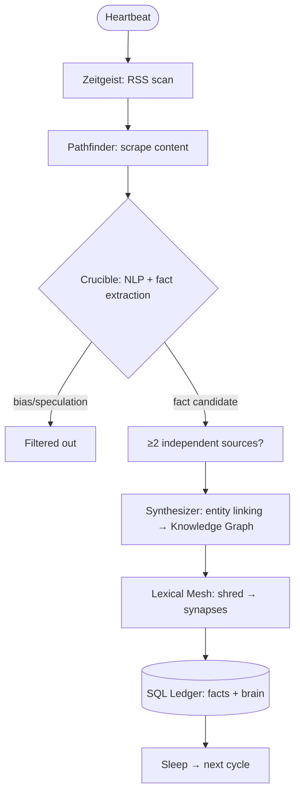

# Axiom Engine

**A decentralized, anti-LLM grounding engine**  
Builds a deterministic lexical mesh + knowledge graph from RSS streams — no probabilities, no GPUs, no black boxes.

[](LICENSE)
[](https://www.python.org/downloads/)

## Core Concept

Axiom nodes continuously:

1. Discover trending topics via public RSS (no tracking APIs)  
2. Extract clean article content (bot-resistant scraper)  
3. Verify & extract **facts only** (spaCy NLP + multi-source corroboration rule)  
4. Link entities → build weighted knowledge graph  
5. Shred facts into linguistic atoms & synapses → open SQL lexical mesh

Result: queryable, fully inspectable symbolic "brain" of corroborated facts.  
Contradictions are flagged. Single-source claims stay `uncorroborated`.

Strongly anti-probabilistic AI — everything is deterministic and auditable.

## Architecture (Heartbeat Cycle)


# Quick Start<br>
```
git clone https://github.com/vicsanity623/AxiomEngine.git
cd AxiomEngine
```

## Install dependencies
```
uv sync
```

### Optional: better NLP accuracy (spaCy model)
```
uv run python -m spacy download en_core_web_sm
```
## Start a node using:
```
export PORT=8009
uv run python -m src.node

        // or using python:

export PORT=8009
python -m src.node 
```
### Build standalone binary (macOS .dmg / Windows .exe)
```
python build_standalone.py 
```
# Inspect & Visualize
```
python view_ledger.py
python view_ledger.py --stats
python view_ledger.py --brain       # top synapses
python visualize_graph.py           # visual HTML graph
```
## Current Status (2026)
	•	RSS discovery + scraping    
            # can be modified to DISCOVER anything
	•	Fact extraction & corroboration     
            # can be modified to extract & corroborate anything
	•	Basic knowledge graph linking
            # makes connections for verification/ disputes/ corroborations
	•	Lexical mesh (linguistic atoms & synapses)      
            # builds a ledger of "language" (voice)
	•	SQL ledger persistence      
            # databse lives in the "Block" network and syncs accross
	•	Mobile/web UI (Universal Terminal)      
            # can interact directly with axiom from anywhere
	•	P2P gossip + sync (full mesh)       
            # nodes remain synced, reboot safe.
	•	Reputation & DAO voting         
            # DAO not yet implemented-brarebones TODO
License
Peer Production License (PPL)

A lightweight, inspectable alternative to probabilistic language models.
